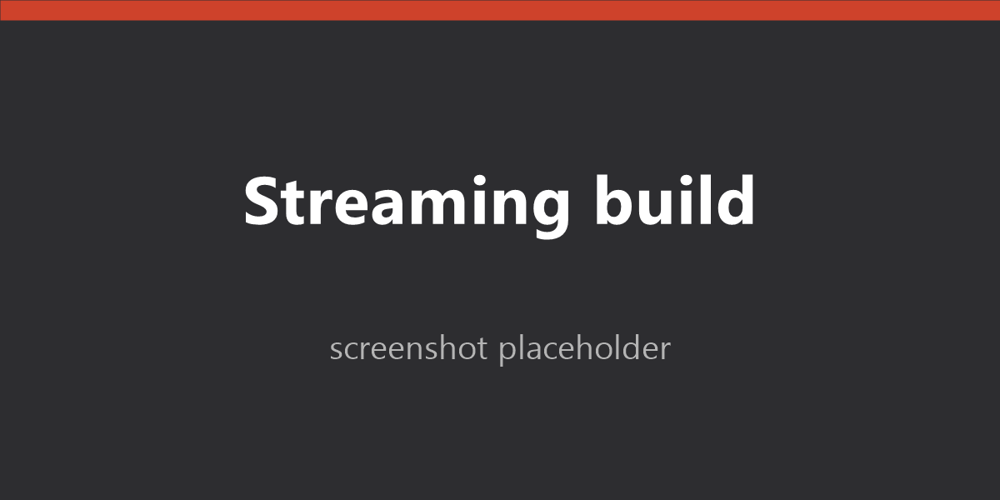
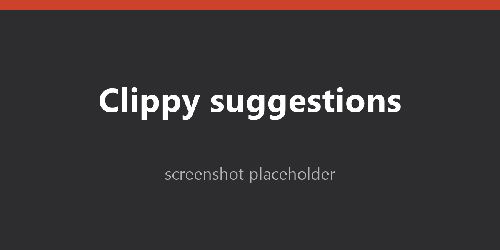
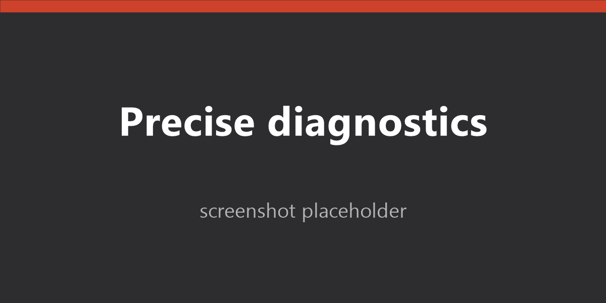

# Cargo MCP for VS Code

**Make GitHub Copilot dramatically better at Rust.**

Instead of typing `cargo` commands into a terminal and squinting at the text
output, Copilot calls Cargo as a set of structured tools — getting precise
diagnostics with exact file paths and line numbers it can act on directly,
streaming progress while builds run, and one-click application of Clippy and
`rustc` fix suggestions.

Install, reload, run `/cargo-mcp:setup` once per repo. That's it.

> **Platforms:** Pre-built binaries ship for **Windows x64 and arm64**.
> Linux/macOS users should
> [build from source](https://github.com/MikeGrier/cargo-mcp-rs#building-from-source).

---

## What you get

- **Precise diagnostics** — JSON-shaped errors with exact file paths and line
  numbers, instead of best-effort parsing of compiler text.
- **Streaming build progress** — long builds report live status in the chat
  panel; a one-line summary collapses into history when finished.
- **Reviewable fix suggestions** — machine-applicable Clippy and `rustc`
  suggestions appear in a checkbox dialog you can accept selectively.
- **Automatic retry on Windows file-in-use errors** — transient antivirus or
  file-indexer collisions in `target\` no longer derail multi-step tasks.
- **Toolchain transparency** — the `cargo_diagnostic` tool reports exactly
  which `cargo` and `rustc` will be invoked, and why.
- **Zero MCP config** — the extension bundles the server and registers it
  with VS Code automatically. No `mcp.json` to edit.

---

## Screenshots

> **Note:** The images below are placeholders shipped with the initial
> release; real screenshots will replace them in a follow-up.

| | |
|---|---|
|  |  |
| **Streaming build progress** in the chat panel. | **Clippy suggestions** in a reviewable checkbox dialog. |
|  |  |
| **Precise diagnostics** with exact file paths and line numbers. |  |

---

## Quick start

1. **Install this extension.**
2. **Reload VS Code** so the MCP server registers and slash commands appear.
3. Open Copilot Chat in **Agent mode** and run:

   ```
   /cargo-mcp:setup
   ```

   This adds a short instruction block to your repository's
   `.github/copilot-instructions.md` (or equivalent) telling Copilot to prefer
   the MCP tools over running `cargo` in a terminal. Commit the change and
   Copilot will use the tools for every future session in that repository.

> **Why the setup step?** Tool descriptions are only visible to Copilot
> *after* it has decided how to carry out a task. A repository instruction
> file is loaded *before* that decision, so it reliably intercepts the choice
> before Copilot reaches for a terminal.

---

## Tools

| Tool | Purpose |
|---|---|
| `cargo_check` | Fast compile-error checking |
| `cargo_build` | Full compilation with diagnostics |
| `cargo_test` | Run tests; structured results |
| `cargo_clippy` | Lints with reviewable fix suggestions |
| `cargo_fmt` / `cargo_fmt_check` | Apply / verify formatting |
| `cargo_doc` | Build documentation |
| `cargo_tree` | Dependency tree |
| `cargo_metadata` | Workspace / package / dependency graph |
| `cargo_clean` | Remove build artefacts |
| `cargo_update` | Update `Cargo.lock` |
| `cargo_fix` | Apply machine-applicable fixes in bulk |
| `cargo_add` / `cargo_remove` | Dependency management |
| `cargo_publish` | Publish to crates.io (`dry_run` recommended first) |
| `cargo_diagnostic` | Report which `cargo`/`rustc` will be invoked |
| `cargo_setup` | Return the canonical Copilot-instruction text |

[Full tool reference and parameter docs →](https://github.com/MikeGrier/cargo-mcp-rs/tree/main/crates/cargo-mcp#tool-reference)

---

## Trust & transparency

Installing a VS Code extension that ships a native binary is a real trust
decision. Here's what's in the box and what mitigates the risk:

- **Written in Rust.** The MCP server is a single Rust crate. Rust's
  memory-safety guarantees apply to all of it by default — buffer
  overflows, use-after-free, and data races in safe code are compile-time
  errors, not runtime exploits.
- **All `unsafe` is in one ~600-line submodule.** The production binary's
  entire `unsafe` surface area lives in
  [`src/rm/`](https://github.com/MikeGrier/cargo-mcp-rs/tree/main/crates/cargo-mcp/src/rm) —
  a safe wrapper around the Windows **Restart Manager** API that powers
  the *"which process is holding this file open?"* diagnostic. Every
  `unsafe` block is a single Win32 call, wraps a documented API
  (`RmStartSession` / `RmRegisterResources` / `RmGetList` / `RmEndSession`
  and `FormatMessageW` / `LocalFree`), uses Microsoft's official
  [`windows-sys`](https://crates.io/crates/windows-sys) bindings (so
  there are no hand-rolled FFI declarations to verify), and carries a
  `// SAFETY:` comment naming the precondition. Session handles are
  released by an RAII guard so leaks and double-closes are not possible
  from safe code. The rest of the crate — argument parsing, cargo
  invocation, output handling, MCP protocol — is `unsafe`-free.
- **Releases are built entirely in GitHub Actions.** Every published VSIX
  is produced from a tagged commit by the
  [`publish-extension`](https://github.com/MikeGrier/cargo-mcp-rs/blob/main/.github/workflows/publish-extension.yml)
  workflow on GitHub-hosted runners — `cargo build --release --locked`
  for the bundled binary, then `vsce package --no-dependencies`, then
  Marketplace upload. The publish step is gated by a required-reviewer
  environment, so no commit reaches the Marketplace without a human
  approval *after* CI has built the artifacts. **No developer machine
  ever touches the published bits.**
- **Reproducible inputs.** Both the Rust build (`--locked`) and the
  extension's `npm` install (`npm ci` against a checked-in
  `package-lock.json`) refuse to use any dependency version not pinned
  in the lockfiles.
- **No telemetry, no network calls** beyond the ones `cargo` itself
  initiates when you invoke `cargo_update`, `cargo_add`, `cargo_publish`,
  etc.
- **The source is the source.** The full repository, including all CI
  configuration, is at
  [github.com/MikeGrier/cargo-mcp-rs](https://github.com/MikeGrier/cargo-mcp-rs).
  You can read every line, audit the `unsafe` blocks, and reproduce the
  build yourself.

---

## Requirements

- **VS Code** 1.101 or later
- **GitHub Copilot Chat** with Agent mode enabled
- **Rust toolchain** (`cargo` on `PATH`)
- [`rustup`](https://rustup.rs/) — optional but **strongly recommended** if
  your repo uses `rust-toolchain.toml`. Without rustup, the toolchain file
  has no effect on any cargo invocation (this is a property of cargo itself,
  not specific to this extension).
- `cargo clippy` and `cargo fmt` components installed if you want
  `cargo_clippy` / `cargo_fmt`

---

## Settings

| Setting | Default | Description |
|---|---|---|
| `cargo-mcp.elicitationMode` | `always-skip` | How to handle machine-applicable fix suggestions: `prompt`, `always-accept`, or `always-skip`. |
| `cargo-mcp.retry.onBusy` | `true` | Retry idempotent cargo invocations (`check`, `build`, `test`, `clippy`, `fmt`, `doc`, `tree`, `clean`, `metadata`) when they fail with a transient Windows file-locking error (`(os error 32)` *sharing violation*, `(os error 5)` *access denied*, *being used by another process*). These usually clear themselves within a fraction of a second once an antivirus, file indexer, or stray process releases the handle. |
| `cargo-mcp.retry.delayMs` | `500` | Delay between retry attempts, in milliseconds. |
| `cargo-mcp.retry.maxAttempts` | `3` | Maximum total attempts (initial try + retries). |
| `cargo-mcp.binaryPath` | _(bundled)_ | Override the path to the `cargo-mcp` binary. Intended for development against a locally-built server. |

---

## Commands

- **cargo-mcp: Open Copilot setup chat** — opens Copilot Chat with the setup
  prompt pre-filled.
- **cargo-mcp: Copy bundled server binary path** — copies the bundled
  `cargo-mcp` binary path to the clipboard.
- **cargo-mcp: Show bundled server version** — displays the bundled server
  version.

---

## Links

- [Source code](https://github.com/MikeGrier/cargo-mcp-rs)
- [Full documentation](https://github.com/MikeGrier/cargo-mcp-rs/tree/main/crates/cargo-mcp)
- [Report a bug](https://github.com/MikeGrier/cargo-mcp-rs/issues)
- [Discussions / Q&A](https://github.com/MikeGrier/cargo-mcp-rs/discussions)
- [Release notes](https://github.com/MikeGrier/cargo-mcp-rs/releases)

## License

MIT

